[mariogutierrez.net](https://mariogutierrez.net) &nbsp;·&nbsp;
[linkedin](https://www.linkedin.com/in/mariogutierrezdelgado/) &nbsp;·&nbsp;
[email](mailto:mariogutierrezcto@gmail.com)

> Currently pursuing my MSc in Data Science at UPM, heading to KTH next year.  
> Always open to connect!

<samp>python &nbsp; scala &nbsp; react &nbsp; javascript &nbsp; html &nbsp; css &nbsp;docker &nbsp; kubernetes &nbsp; postgresql &nbsp; mongodb &nbsp; elasticsearch</samp>

**[mini-gpt](https://github.com/maariogutierrez/mini-gpt)** &nbsp;·&nbsp; <samp>python</samp> 
Built a GPT-2 architecture from scratch in PyTorch and trained it on the  TinyStories dataset. The result is a lightweight model that generates  coherent, short form children's stories.

**[pacman](https://github.com/maariogutierrez/pacman)** &nbsp;·&nbsp; <samp>python</samp> 
A Deep Q-Network agent that learns to play Pac-Man from scratch via  reinforcement learning. No hand-coded rules, no hardcoded strategies  — just a neural network, a reward signal, and a lot of episodes.

**[rubiks-solver](https://github.com/maariogutierrez/rubiks-solver)** &nbsp;·&nbsp; <samp>python</samp> 
A 3x3x3 Rubik's Cube solver that uses a supervised neural network  trained with Bellman targets employing curriculum learning as a  heuristic for A* search.

**[dynamic-risk-assesment-dashboard](https://github.com/maariogutierrez/dynamic-risk-assessment-dashboard)** &nbsp;·&nbsp; <samp>python, javascript, html, css, docker, elasticsearch</samp> 
A Flask-based web application for dynamic cybersecurity risk assessment,  combining OWL ontology modeling with Elasticsearch-backed storage to  visualize, compute, and propagate risk scores across system architectures.

This page was created using the code from [`andriidrok1`](https://github.com/andriidrok1).
